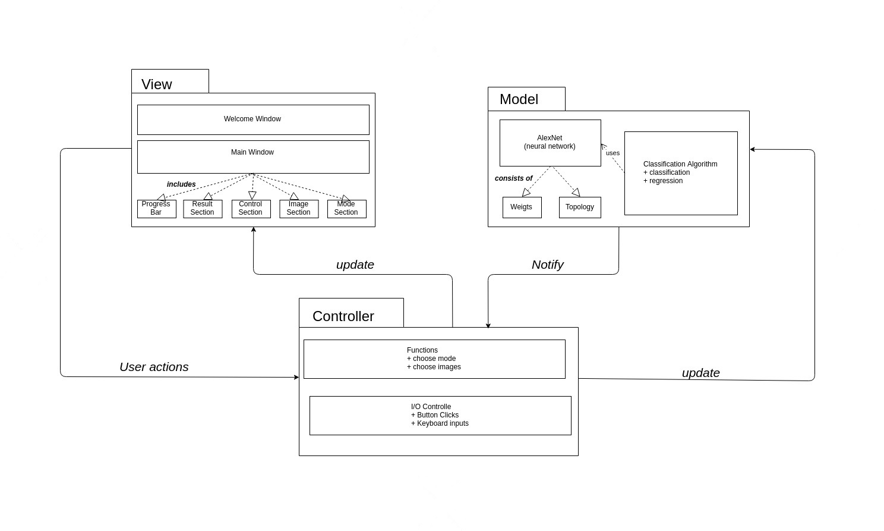
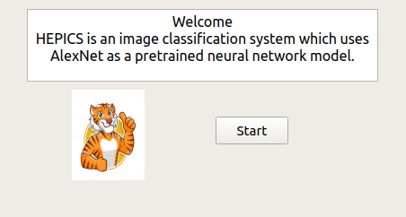
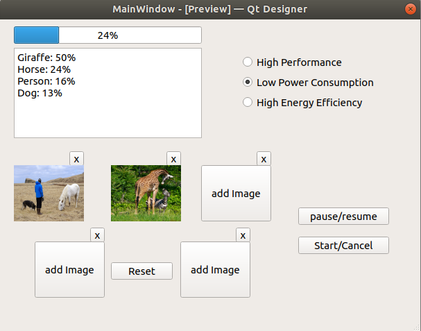
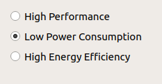
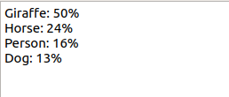
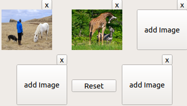
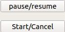

# Introduction #
This project consists in building an image classification system, which takes images as input and gives a prediction -in percentages- of what would be on these given images. For instance, the system may receive an image of a human face as input, after treating the data, the output is then represented in a small list of objects that may be on the picture, ordered by their probability percentages. In this case, the system should display a list, whose first element "human face" is, next to the probability which the system calculated for this result.

The motivation behind this project is artificial neural networks. These are computing systems which were inspired by the biological neural network of an animal. Such systems gain knowledge in executing tasks -in our case image recognition- through a certain training. For an image recognition neural network to correctly perform its task, it is required to analyze examples of images that have been manually labeled. Other uses where artificial neural networks are deployed are predictions, function approximations, or real life patterns recognition...

Nowadays, machine learning is gaining in importance as the goal of including machines in various activities -industries, services, economy- in order to reach high levels of efficiency is in need of artificial intelligence. Indeed, under the applications of artificial neural networks, we can mention autonomous driving, natural language processing, gesture recognition, and of course, face recognition, which is the main application of this project.

It must not be forgotten to mention as well, that there exists different neural networks models, such as Back-Propagation, Boltzman Machines and Deep Neural Networks, with which we will deal in this project. In particular, we will deal with "AlexNet", which is a convolutional neural network consisting of 8 layers, 5 of which are convolutional while the others are fully-connected layers.

On one hand, deploying deep neural networks not only means unlocking a massive parallelism potential for our system, but it also means that unsupervised learning is most definitely possible. On the other, we are in need of a huge data set for this unsupervised training. It is important to mention as well, that deep neural networks require intense computations, which manifests itself in high power consumption and learning and classification time.

For the sake of decreasing the number of disadvantages of deep neural networks, the decision of using heterogeneous platforms such as CPUs, GPUs and FPGAs was made. These will provide the system with a good performance for a wide range of computations, as well as a decent usage of pipelines and parallelism, and of course, all with low power consumption.

To take a taste at the fascinating world of machine learning and artificial neural networks, we invite you to try out our image recognition system, and maybe even have a little fun with it.

# Target specifications #

## Must-requirements ##

* The system must be able to classify images.
* The system must allow the selection of one or more input images.
* The system must show the result of the treatment.
* The system must employ artificial neural networks.
* The system must deploy the AlexNet deep neural network.
* The system must know at least one set of weights.
* The system must be able to execute intense calculations through heterogeneous platforms (CPU, GPU, FPGA, ASIC).
* The system must support an FPGA through OpenCL.
* The system must hide the OpenCL details behind an abstraction layer.
* The system must offer three performance profiles : 
    - High Performance
    - Low Power
    - Energy Efficency
* The system must allow the control and the execution of commands through a GUI interface.
* The system must be able to run the GUI on an Ubuntu system.
* The system must exhibit a classification interface.
* The system must be able to measure its performance.
* The system must be able to measure its power consumption.
* The system communicate with another system. It looks into a file to search for an image treatment request, and send back the results via Ethernet connection.
* The system must include the aggregate feature. This feature fuses the results of different treatments of the same object in order to reach more precision.
* The system must offer the possibility of entering up to 5 images in the aggregate feature.

## Can-Requirements ##

* The system can offer the possibility of entering more than 5 images in the aggregate feature.
* The system can deploy a GPU.
* The system can deploy a DSP.
* The system can deploy the GoogleNet neural network next to AlexNet. 
* The system can allow the training of neural networks.
* The system can display the topology of the neural network.
* The system can write the results into a file in order to use it for another program.
* The system can run batch processing.
* The system can carry out transfer learning of the already implemented neural network.
* The system can beautify the output result.
* The system can generate weight files.
* The system can load different weight files.
* The system can pause, resume or cancel the classification process.

## Criteria of demarcation ##
* The system cannot be a real-time application.
* The system cannot run on mobile-plattforms.

# Product Use #
 
## Field of application ##
This program is designed for image classification. The user or system can use this program to recognize pre-specified or learned objects. Because the system runs on heterogeneous platforms, the user is allowed to switch between various operation modes depending on power or performance preferences.
Victims of strokes or memory problems have a hard time recognizing even the most simple objects we deal with everyday. Building on this system, it would be possible to help these people to rebuild their memories or label the objects presented on the images. It can also help the visually disabled have a better idea about their environment through processing images they choose.
Another application of this system is the optimization of the traffic lights through equipping them with a functionality that would set the traffic free for other sides, if the current side is empty.
We can think about a use in the tourism field as well, as tourists may want to have a better idea about buildings or statues of the city they are visiting, which they can do through our system.
 
## Target Group ##
* people with impaired vision
* tourists
* developers of other systems
* users who need to classify images
* systems which process images or solve problem in computer vision

 
## Operation Condition ##
The following conditions must be met:

* Hardware and software as follows must be available: 
    - Host PC with Ubuntu 16.04
    - FPGA
* System and possible user-system must be installed.
* Images must be accessible to file system.
* Host PC must be powered.
* FPGA must be powered.
* Images must be JPG.
* FPGA have to be connected to Host PC.
* There must be enough storage for the program.
* There must be enough storage to store results. 

# Product Environment #
 
## Software ##
* Ubuntu 16.04 - operating system of Host PC
* QT - to create classic and embedded GUI
* OpenCL - framework for writing programs that execute across heterogeneous platforms
 
## Hardware ##
* Desktop PC
* DElSoC (SOC that includes FPGA)

# Product Functions #
## Basic Functions ##

* /F010/ Show welcome window.
* /F020/ Show main window. 
* /F030/ Choose input image (at most 5 images of an object).
* /F040/ Remove single image from the selection.
* /F050/ Show thumbnails of the selected images.
* /F060/ Reset the selection of the images.
* /F070/ Choose operation mode: 
        High Performance
        Low Power Consumption
        High Energy Efficiency.
* /F080/ Change the operation mode before starting processing.
* /F090/ Block parts of GUI.
* /F100/ Start processing.
* /F110/ Pause processing.
* /F120/ Resume processing.
* /F130/ Cancel processing.
* /F140/ Switch between start button and cancel button.
* /F150/ Switch between pause button and resume button.
* /F160/ Run calculation through FPGA.
* /F170/ Aggregate results of multiple images.
* /F180/ Show output results (names and precentages of top 4).
* /F190/ Terminate program.
* /F200/ Start a new classification.
* /F210/ Poll the request file from another system.
* /F220/ Send back the results via ethernet.

## Optional Functions ##

* /F230/ Run calculation through GPU.
* /F240/ Run calculation through ASIC.
* /F250/ Choose the neural network topology.
* /F260/ Show the neural network topology.
* /F270/ Deploy training of an arbitrary neural network.
* /F280/ Transfer learning of the already implemented neural network.
* /F290/ Show a progress bar while classifying.
* /F300/ Show output results in clear form (with a histogram).
* /F310/ Write output results into a new file.

# Product-Data #
## System-Data ##

 * /D10/ Classification results with percentage bars.
 * /D20/ The nodes' weight files.
 * /D30/ The neural network's topology.

## User-Data ##
 
 * /D40/ The input images are saved.
 * /D50/ The results are saved.

# System Model #

Programming with less complexity makes delightful code that is less buggy and easier to maintain because it is reusable without modification. In order to achieve this goal we use in this context the MVC architecture which consists of three parts: Model, View and Controller.

## Model ##
The model represents the domain. The model does not depend on the controller or the view. It contains the pretrained neural network model AlexNet as well as the classification algorithm to be used on images.The neural network itself is composed of a set of weights and topology. The toplogy sepecifies how the layers interact with each other. On the other hand the weights define when the neurons are activated. The layers are invoked by the scheduler which is responsible for resolving dependencies between them.

## View ##
The view displays the model data. The model data is in this case the input images,  the output results and the chosen operation mode as well as the current state of the process (e.g. in pause, running, waiting for input). Besides it sends user actions (e.g. button clicks, inputs) to the controller. It represents the graphical user interface which allows the user to interact with the system (See Graphical User Interface)

## Controller ##
* The controller interprets user actions such as button clicks. It depends on the view and the model and controls the interactions between them.

## Use Cases ##

### Use Case: Give classification request ###

Primary Actor: External system

Stakeholders and Interest:
	External systems human user: Wants external system to provide its service fast, accurate and energy efficient.

Preconditions:
	Input images were sent.

Post conditions:
	The input images were sent.

Main Success Scenario:
1. User runs external system.
2. External system writes command to request file.
3. Image classification system reads request file.
4. Image classification system accepts the request.

Extensions:

*a. At any time, image classification system is shut down:

1. A shut down signal is sent.
    
3a. The request is invalid.

1. An error signal is sent.

### Use Case: Send input image ###

Primary Actor: External system

Stakeholders and Interest:
	External systems human user: Wants external system to provide its service fast, accurate and energy efficient.

Preconditions:
	External system and image classification system are running.
	The external system must be connected to the image classification system.
	The external system must be able to write the request file.

Postconditions:
	The image classification system has access to the images to be classified.

Main Success Scenario:
1. User runs external system.
2. External system sends image file to filesystem of image classification system.
3. External system repeats 2 until done.

Extensions:

*a. At any time, image classification system is shut down:

1. A shut down signal is sent.

### Use Case : Select single image ###
1. Preface elements
Scope : Image Classification System  ; Level : User Goal.
Primary Actor : User.

2. Stakeholders and Interest List
User : wants the classification of an image through selecting one single image as an input, and needs the result showed in a clear form, without any errors.

3. Preconditions
The system is started, the welcome screen is showed, the main window loads correctly.

4. Post conditions (Success Guarantees)
The input image is correctly selected. The thumbnail of the image is showed on the screen with the possibility of removing it. The start button is active and the classification can be started.

5. Main Success Scenario
  1. User starts the program.
  2. Welcome screen is displayed.
  3. User clicks on the "start" button.
  4. Main window is displayed.
  5. User clicks on a "add image..." button.
  6. User selects an image.
  7. System loads image file.
  8. Selected image's thumbnail is displayed and start button is activated.

6. Extensions (a.k.a alternative flows)
  * a. At any time system fails :
    1. System signals error to the user, records the error and enters a clean state. 
    2. System reloads the main window.
  6a. Invalid input image :
    1. System signals the invalid input and rejects it.
    2. User selects a new input image, or cancels the selection.
    
7. Technology and Data variations
- Only image files are accepted as input.

### Use Case : Get Result ###
1. Preface elements
Scope : Image classification system; Level : User Goal
Primary Actor : External system.

2. Stakeholders and Interest List
External system : wants the classification of an image through sending one single request, and needs the result in a clear form, without any errors. Receives then the results through ethernet.
User of the external system : sends a request through the external system and awaits for the correct and clear results of his request. 

3. Preconditions
A classification request is given by the external system through sending an input image. It is then detected by the image classification system which loads the image and starts classifying it. The classification should run smoothly and be finished.

4. Post conditions (Success Guarantees)
The sent input image is correctly classified. The results are saved into a file. The file is sent to the external system.

5. Main Success Scenario
1. User sends an input image through the external system.
2. Image classification system detects the classification request.
3. System loads the input image.
4. System starts the classification.
5. System shows results.
6. System saves results into a file.
7. External system reads file.

6. Extensions (a.k.a alternative flows)
* a. At any time system fails :
   1. System restarts, signals error to the external system, records the error, and enters a clean state.
   2. System loads in input image and restarts classification.
2a. Invalid input image :
  1. System signals the invalid input and rejects it.
6a. Saving failed :
  1. System signals fail.
  2. System retries saving file.
  
7. Special requirements
- Ethernet connection between the system and the external system to allow file sharing.
- System runs per default on high-efficiency mode.
8. Technology and Data variations
- Results are saved into a text-file.

### Use Case: Select operation mode ###

Primary Actor: User

Stakeholders and Interests:
*	User: 	Wants fast and accurate selection of the operation mode. 
		Wants fast update of the mode when changing selection.

Preconditions:
*	The Classification system is started.
*	The user skipped the Welcome-Window and is in the Main-Window.
	
Posconditions:
*	The system is aware of the chosen mode.

Main Success Scenario:
1. User starts the classification process
2. Operation-Mode- and Imge-Section in the GUI are disabled
3. Progress bar is showing the stand of the process
4. The Process terminates in the predicted way wich corresponds to the mode.

Extensions:

*a. At any time system fails 
*	1. User choose the operation mode again
*	2. User load images again
*	3. User restart the process
* 3.a Progress bar does not show the right progress indication anymore
*	1. System continue its execution without taking that in accournt

### Classify image ###

Primary Actor: User, External System

Stakeholders and Interest:
	User: Wants images to be classified accurately and fast.
	External System: Wants images to be classified accurately

Preconditions:
*	Input images were sent by the external system or the user loaded the images.
*	The operation mode was selected.
*	The weight file to be used is already available to the system.

Posconditions:
	The classification process is terminated successfully
	
Main Success Scenario:
1. Classification process terminates.
2. Results are displayed on the main window.
3. Results are saved in a file (for external systems).
4. send the file with results to the external system.

Extensions:

1.a Classification process fails to terminate.
*	1. User choose the operation mode again.
*	2. User load images again.
*	3. User restart the process.
2.a Program fails to display results.
*	1. User choose the operation mode again.
*	2. User load images again.
*	3. User restart the process.
4.a File was not sent due to bad connection.
*	1. Check connection with the external system.
*	2. Reset Connection.
*	3. Send the file again.
4.b File was not sent because the file was not saved ata all.
*	Restart process again.

### Use Case: Select mutiple images ###

Primary Actor: Actor

Stakeholders and Interest: 
        User: Wants to classify objects more accurately by providing multiple images.

Preconditions: 
        Image classification system is running. 
	The user prepared multiple images of the same object he wants to classify.

Post conditions: 
        Up to 5 images files of the same object are accesible to the system.

Main Success Scenario:

 1. User choose one image of a target object.
 2. User repeats step 1. up to four times.
 
Extensions:

*a. The extension name of file isn't supported.
   
   1. An error signal is displayed on the screen.
   
*2a. One of image is removed.

   1. The system updates the state and is ready for the next selection.
   
*2a. The selection is reseted.

   1. The system initializes the selection state.

*2a. Choose another image after 5 images have been selected.
   
   1. The file isn't accepted by the system.
   
   
### Use Case: View Results ###

Primary Actor: Actor

Stakeholders and Interest: 
        User: Wants to get results of the classification.

Preconditions: 
        The processing of classification was finished successfully. 
	The system aggregated the results of mutiple images. 

Post conditions: 
        The results are displayed successfully. 
	The new file with results is accessible to the user.

Main Success Scenario:

 1. User views results on the screen, which displays a histogram with the names and percentages of top 4 object classes.
 
Extensions:

*a. The user wants a new file containing the results.
 
   1. The system creates a new text file including the results of classification.

# Product Performance #
* /P010/ The user clicks on a start button in order to start the program.
* /P020/ The user chooses the operation mode with one click.
* /P030/ The user switches between operation modes in one click.
* /P040/ The user uploads an image in a maximum of three clicks.
* /P050/ The user removes an image in one button.
* /P060/ The user resets the selection in one button.
* /P070/ The system shows a progress bar while classifying.
* /P080/ The user pauses the process in one click.
* /P090/ The user resumes the process in one click.
* /P100/ The user cancels the process in a maximum of three buttons.
* /P110/ The user exits the program in a maximum of three buttons.
* /P120/ The user starts a new classification in a maximum of three buttons.
* /P130/ Low Power Consumption Mode should consume the least amount of power.
* /P140/ High Performance Mode should execute the fastest.
* /P150/ High Energy Efficiency Mode is the most power consumption and time efficient of the three modes.

# Graphical User Interface #
## Introduction ##
The GUI, which represents the front-end, is the communication channel between the user and the back-end (the internal system). It will guide users through the variety of operations which can be performed by the System.

## Welcome-Window ##
After the program starts, a welcome window with information on the Software will be displayed. This information consists of a short description of the  system and the current version of the software.(See figure x.xx)

## Main-Window ##
After clicking on Start-button in the welcome window, another window will pop up. It is called main window.The main window contains multiple sections: 

### Choose-Operation-Section ###
 The user has to choose a running mode:
* 1- High Performance
* 2- Low Power Consumption
* 3- High Energy Efficiency
* See figure (x.xx)

### Result-Section ###
The result section contains results of aggregation. The results are represented in form of text. The results are the probabilities of the top detected objects in percentages.  

### Progress-Bar ###
The progress bar shows the state of the current running process.

### Image-Section ###
The image section consists of multiple buttons which can be used to add images. Thumbnails are generated afterwards and will be displayed on the buttons. An image can be removed through clicking on the remove-button. All images can also be removed at once if the user clicks on the reset-button.

### Control-Section ###
By using the control section the user is able to start and cancel the process. Once the classification starts, the start button becomes a cancel button. While running the user can pause the classification by clicking on the pause button. In this case the pause button becomes a resume button.

# Quality Specification #
* The FPGA should accelerate or save power.
* The test coverage should be as high as possible.
* Maintenance and reusability results is reached through the implementation in the MVC principle.
* Robustness plays a crucial role in the development, so that arbitrary keystrokes do not lead to a crash.
* Code quality should avoid any kind of embarassing pauses.
* A well-structured design should provide the system with extensibility and portability.
* Low Power Consumption Mode provide the system with power saving.
* High Performance Mode provides the system with high performance.
* High Efficiency Mode provides the system with power consumption and -time efficiency.
* A presentable GUI guides the user easily through the process.

# Test Cases #

All functions are tested by the following test cases. The basic tests test the basic functions. The extended tests test the optional functions. The actions described here are atomic from a users point of view.

## Basic tests  ##
* /T010/ Start application. (/F010/, /F090/)
* /T020/ Press start on welcome screen. (/F020/)
* /T030/ Start file open dialog for image. (/F030/)
* /T040/ Choose image file. (/F030/, /F050/)
* /T050/ Choose a file, whose format is not supported. (/F030/)
* /T060/ Choose multiple input image files. (/F030/)
* /T070/ Abort image file selection. (/F030/)
* /T080/ Remove a selected image. (/F040/)
* /T090/ Reset the selection of images. (/F060/)
* /T100/ Choose operation mode high performance. (/F070/, /F080/)
* /T110/ Choose operation mode low power consumption. (/F070/, /F080/)
* /T120/ Choose operation mode high energy efficiency. (/F070/, /F080/)
* /T130/ Start processing. (/F100/, /F090/, /F140/, /F160/)
* /T140/ Pause processing. (/F110/, /F150/)
* /T150/ Resume processing. (/F120/, /F150/)
* /T160/ Cancel processing. (/F130/, /F140/)
* /T170/ Finish processing. (/F090/, /F140/, /F170/, /F180/)
* /T180/ Close program. (/F190/)
* /T190/ Start new classification. (/F200/)
* /T200/ Receive a classification request in the request file. (/F210/, /F220/)

## Extended tests  ##
* /T210/ Start processing. (/F230/, /F240/, /F290/)
* /T220 Finish processing. (/F300/, /F310/
* /T230/ Start file open dialog for topology. (/F250/)
* /T240/ Choose topology. (/F250/)
* /T250/ When choosing a topology choose a non topology file. (/F250/)
* /T260/ Press show topology button. (/F260/)
* /T270/ Start file open dialog for weights. (/F270/)
* /T280/ Choose weights. (/F270/)
* /T290/ When choosing weights choose a non weights file. (/F270/)
* /T300/ Choose weights for another topology (/F270/)
* /T310/ Choose AlexNet (/F270/)
* /T320/ Choose GoogleNet (/F270/)
* /T330/ Run transfer learning (/F280/)

# Test Scenarios #

The test scenarios consist of the test cases listed above.

## Classify an Image  ##

The user runs the application and classifies an image.

# Development Environment #
## Software ##
* Operating system
    * Ubuntu 16.04
* Development tools
    * Eclipse
    * Eclipse CDT
    * Gcov
    * Boost
    * Qt
    * Qt Designer
    * Altera SDK for OpenCL
* Version-control
    * Git
* Documentation
    * Markdown
    * Latex

# Glossar #

* Neuronale Netze
* Alex Net 
* FPGA GUI
* GPU
* DSP
* Google Net
* Beschleunigungshardware
* High Performance
* Low Power
* Energy Efficency
* Ubuntu
* QT
* Workstation
* Echtzeitanwendung
* Moblile Plattformen
* Thumbnail

